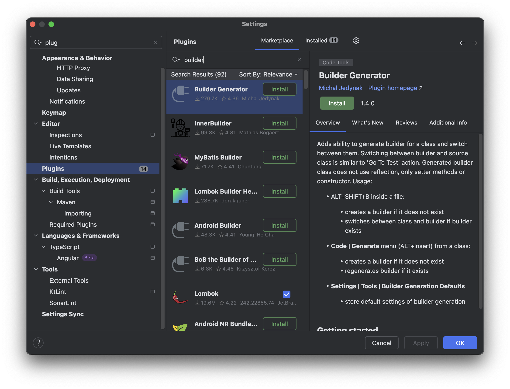
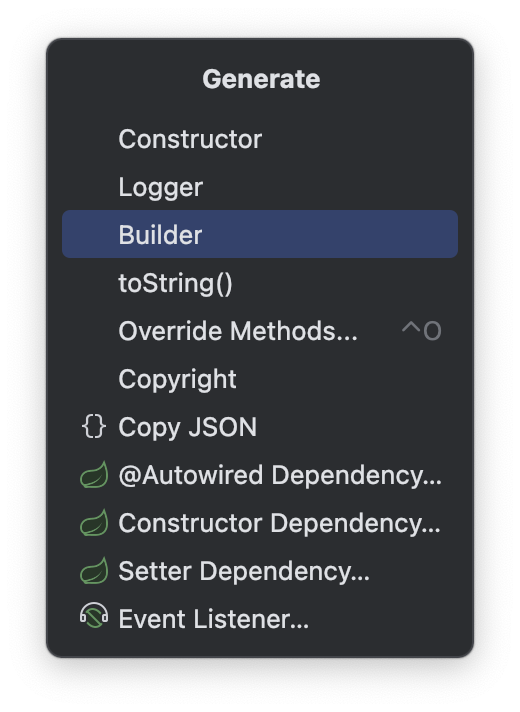

Lombok을 활용해서 빌더를 손쉽게 사용할 수있지만 Lombok을 사용하지 않고도 쉽게 만들 수 있는 방법을 정리하였습니다.

## Builder Generator 플러그인 설치



Settings > Plugins > Marketplace > Builder Generator 설치

## 빌더 클래스 생성 방법



- `command + n`을 누를 시 Builder가 새로 추가됨

## 빌터 패턴 소개

### Member 객체

```java
public record Member(
        String name, // mandatory
        String email, // mandatory
        int age // optional
) { }
```

### 문제점
```java
Member member = new Member(name, email, age);
```

1. 객체를 생성할 때 어떤 값이 필수 값인지 옵션 값인지 인지 하기 어렵다
2. 생성자로 객체를 생성 할 경우 반드시 순서를 맞추야 한다 (값의 순서를 착각할 경우 문제를 찾기 어려워짐)

### 해결 방법

https://plugins.jetbrains.com/plugin/22851-plugin-devkit