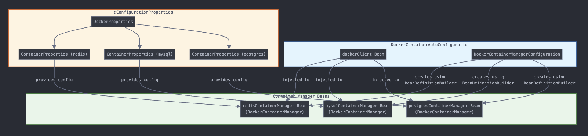
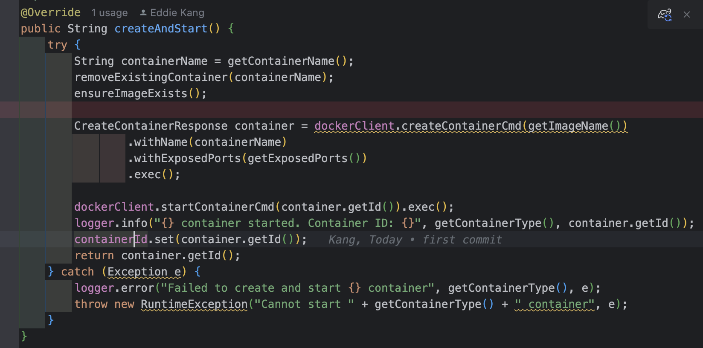
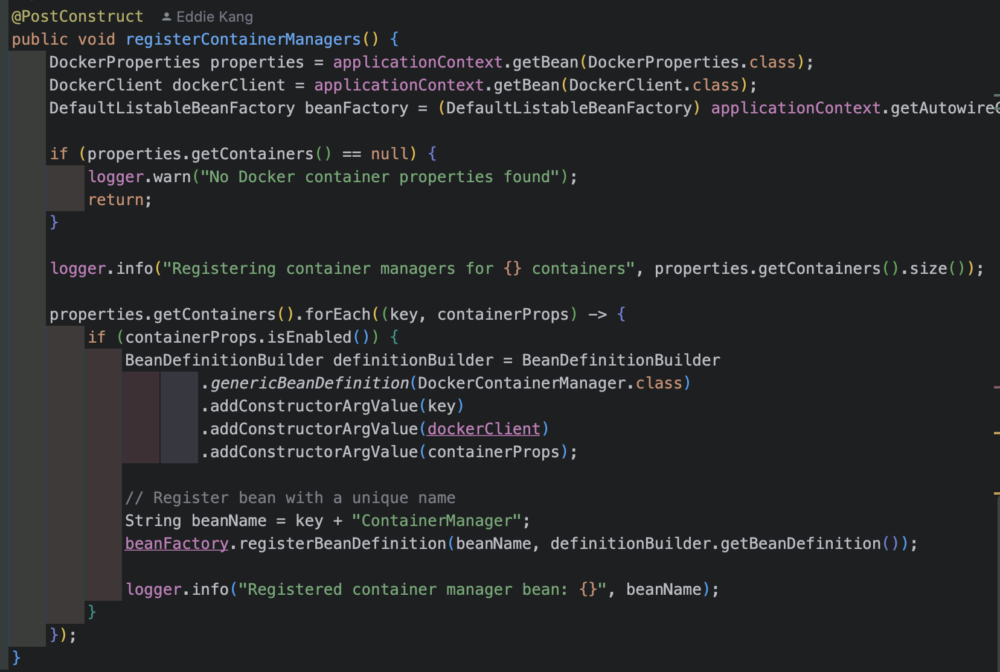
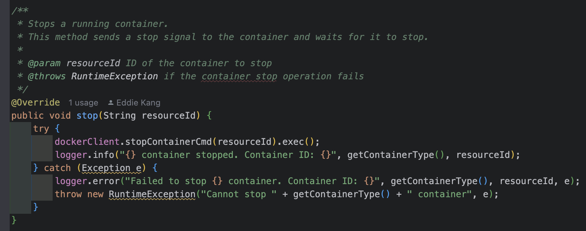
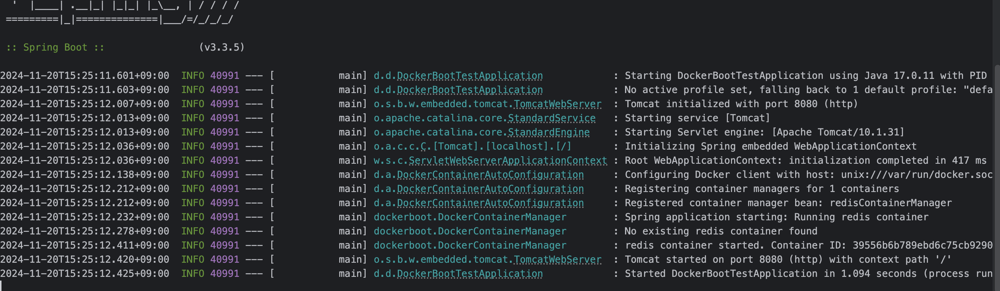
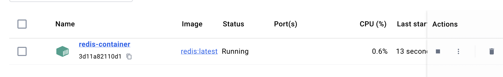

# Docker 컨테이너 관리를 위한 Docker Boot 개발기

안녕하세요! 
이번에 Spring Boot 애플리케이션에서 Docker 컨테이너를 쉽게 관리할 수 있는 'Docker Boot'를 개발하게 된 과정을 공유하고자 합니다.

```yaml
docker:
  host: unix:///var/run/docker.sock
  tls-verify: false
  registry-url: https://index.docker.io/v1/1
  containers:
    redis:
      enabled: true
      container-name: redis-container
      image-name: redis:latest
      ports:
        6379: 6379
```

이렇게만 하면 스프링 킬 때 도커 컨테이너가 자동으로 켜지고 끌 때 스프링을 끌때 자동으로 꺼진다고?! 마법이쟈나...

## 개발 배경

### 개발하게 된 배경

평소 Spring Boot로 개발할 때 로컬 개발 환경에서 Redis, MySQL 등의 데이터베이스나 서비스들을 Docker로 실행하곤 했습니다. 이 과정에서 몇 가지 불편함을 느꼈습니다.

매번 Docker 컨테이너를 수동으로 시작/종료해야 했고 (이게 가장 큼),
TestContainers를 테스트 코드가 아닌 프로덕션에 가져오는게 적합해 보이지 않았습니다.

### 해결 방안 구상

위의 문제들을 해결하기 위해 필요한 내용들을 정리했습니다.

1. Spring Boot 애플리케이션과 Docker 컨테이너의 생명주기 통합
2. YAML 설정만으로 컨테이너 관리 가능
3. 여러 환경(로컬, 테스트 등)에서 일관된 설정 제공
4. 다중 컨테이너 지원

## 개발 과정

### 기술 스택 선택

- **docker-java**: Docker Engine API를 자바로 쉽게 사용할 수 있는 라이브러리
- **Spring Boot Auto-configuration**: 자동 설정을 통한 편리한 통합

두 라이브러리를 베이스로 삼아서 개발을 진행했습니다.

### 핵심 컴포넌트 설계

*DockerContainerAutoConfiguration.class*
```java
@AutoConfiguration
@ConditionalOnClass(DockerClient.class)
@EnableConfigurationProperties(DockerProperties.class)
public class DockerContainerAutoConfiguration {

    @Bean
    @ConditionalOnMissingBean
    public DockerClient dockerClient(DockerProperties properties) {
        // Docker 클라이언트 설정 및 생성
        return DockerClientBuilder.getInstance(config)
                .withDockerHttpClient(httpClient)
                .build();
    }

    @Configuration
    class DockerContainerManagerConfiguration implements ApplicationContextAware {
        
        @PostConstruct
        public void registerContainerManagers() {
            // 각 컨테이너 설정마다 매니저 빈 등록
            properties.getContainers().forEach((key, containerProps) -> {
                if (containerProps.isEnabled()) {
                    String beanName = key + "ContainerManager";
                    // 빈 정의 및 등록
                }
            });
        }
    }
}
}
```

DockerContainerAutoConfigure가 받아온 Properties 정보들을 통해
각 컨테이너 (예시: Redis, Mongo, MySQL 등등)의 XXXContainerManager를 생성합니다.



그리고 생성된 ContainerManager는 Spring SmartLifeCycle에 의해 자동으로 도커 컨테이너가 뜨도록 구현하였습니다.

*AbstractContainerManager 일부*


#### 설정 클래스 구조

```java
@ConfigurationProperties(prefix = "docker")
public class DockerProperties {
    private String host;
    private boolean tlsVerify;
    private Map<String, ContainerProperties> containers;
    // ...
}

public class ContainerProperties {
    private String imageName;
    private String containerName;
    private Map<Integer, Integer> ports;
    private Map<String, String> environment;
    // ...
}
```

### Auto-configuration 구현

Spring Boot의 자동 설정을 활용하여 사용자가 별도의 설정 없이도 바로 사용할 수 있도록 구현했습니다.

```java
@AutoConfiguration
@ConditionalOnClass(DockerClient.class)
@EnableConfigurationProperties(DockerProperties.class)
public class DockerContainerAutoConfiguration {
    // Docker 클라이언트 및 컨테이너 매니저 빈 설정
}
```

### 개발 중 마주친 문제와 해결

#### 1) 빈 생성 순서 문제
초기에는 BeanFactoryPostProcessor를 사용했으나, properties가 완전히 초기화되기 전에 실행되는 문제가 있었습니다. 이를 해결하기 위해 @PostConstruct를 활용했습니다.



#### 2) 스레드 안전성
여러 스레드에서 컨테이너 상태를 안전하게 관리하기 위해 AtomicBoolean과 AtomicReference를 사용했습니다.


#### 3) 리소스 정리
애플리케이션 종료 시 컨테이너가 제대로 정리되지 않는 문제가 있었습니다. SmartLifecycle의 stop() 메서드에서 확실한 정리가 이루어지도록 구현했습니다.



## 사용 예시

### 기본 설정

먼저, 라이브러리를 받기 위해 의존성을 추가해줍니다.

Gradle:
```groovy
dependencies {
    implementation 'io.github.ddaakk:docker-container-spring-boot-starter:0.1.0'
}
```

Maven:
```xml
<dependency>
    <groupId>io.github.ddaakk</groupId>
    <artifactId>docker-container-spring-boot-starter</artifactId>
    <version>0.1.0</version>
</dependency>
```

그 후 두 가지 방식 중 하나를 선택해서 사용하시면 됩니다!

```yaml
docker:
  containers:
    redis:
      enabled: true
      container-name: my-redis
      image-name: redis:latest
      ports:
        6379: 6379
```

### 프로그래밍 방식 사용
```java
@Service
public class MyService {
    private final DockerContainerManager redisManager;
    
    public MyService(@Qualifier("redisContainerManager") DockerContainerManager redisManager) {
        this.redisManager = redisManager;
    }
}
```





## 향후 계획

컨테이너 리소스 제한 기능, 메트릭 수집, 컨테이너 상태 모니터링 등을 지원하려고 생각 중입니다.

## 참고
실제 라이브러리 배포는 [이 곳](https://dami97.tistory.com/36)을 참고하였습니다.


## 다운로드 및 소스 코드
[라이브러리 다운로드 경로](https://central.sonatype.com/artifact/io.github.ddaakk/docker-boot)
[라이브러리 소스 코드](https://github.com/ddaakk/docker-boot/tree/main)