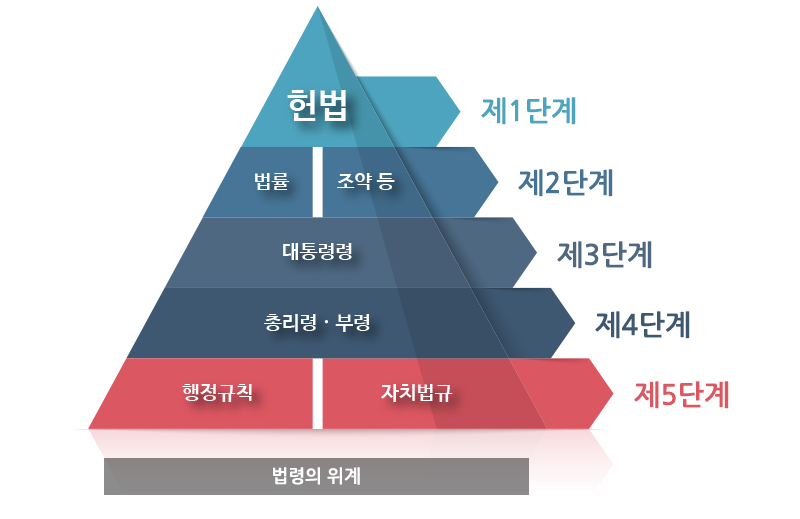
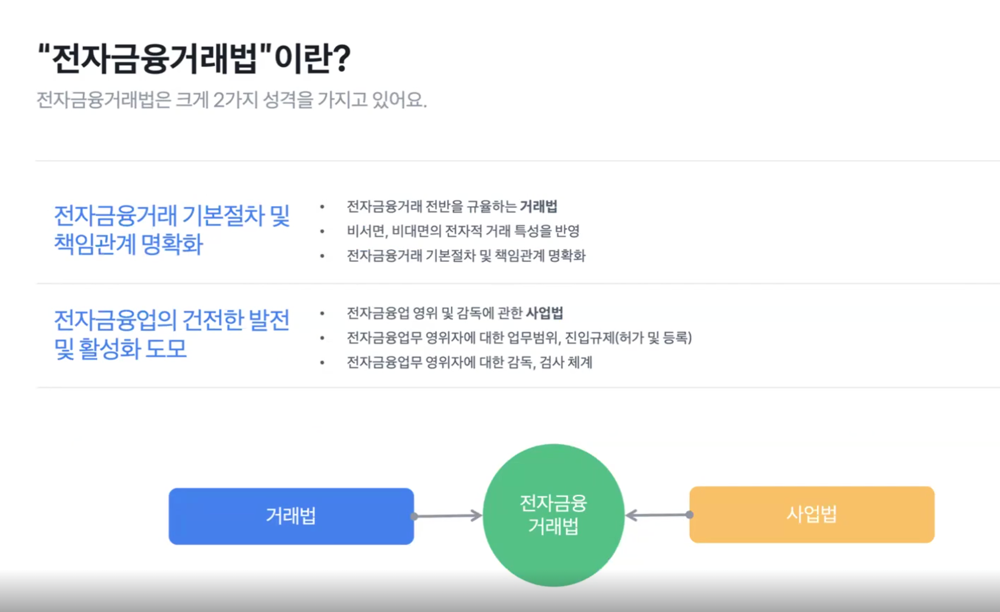

## 법률 기초

법은 위계가 있다.
헌법을 가장 최상위 법 규범으로하고, 그 밑으로 위임하는 형식이다.
위로 갈수록 추상적이고 선언적이며, 아래로 갈수록 구체적이고 상세하다.

법을 살펴보고 싶다면, [여기](https://www.law.go.kr/)에 들어가보면 좋다.

## "전자금융거래법" 이란?

1. 전자금융거래법은 전자적 방식으로 금융 거래를 수행할 때의 안전성과 신뢰성을 확보하기 위해 제정된 법률
2. 이 법은 금융기관과 전자금융업자, 그리고 금융 소비자간의 전자금융 거래에 대한 규제와 의무를 명시
3. 주요 내용으로는 전자 금융거래의 정의, 금융기관의 책임, 소비자 보호 방안 그리고 전자금융업자의 인허가 요건 등이 포함
4. 이를 통해 전자금융 거래가 안전하게 이루어질 수 있도록 법적 기반을 제공하고, 금융 소비자들이 안심하고 거래할 수 있는 환경을 조성하는데 목적이 있음

전자금융거래법에는 크게 두 가지 성격이 있다.
전자금융거래 전반을 규율하는 거래법과 전자금융업 영위 및 감독에 관한 사업법이다.

### "전자금융거래"는?
"전자금융거래"는 금융회사 또는 전자금융업자가 전자적 장치를 통하여 금융상품 및 서비스를 제공(이하 "전자금융업무"라 한다)하고,  
이용자가 금융회사 또는 전자금융업자의 종사자와 직접 대면하거나 의사소통을 하지 아니하고 자동화된 방식으로 이를 이용하는 거래를 말한다.