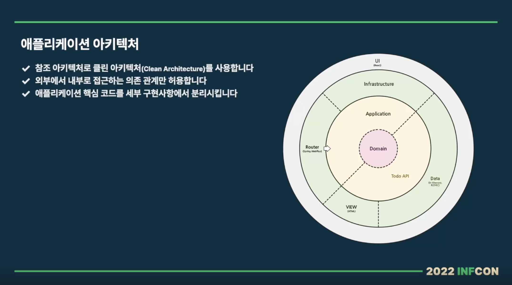
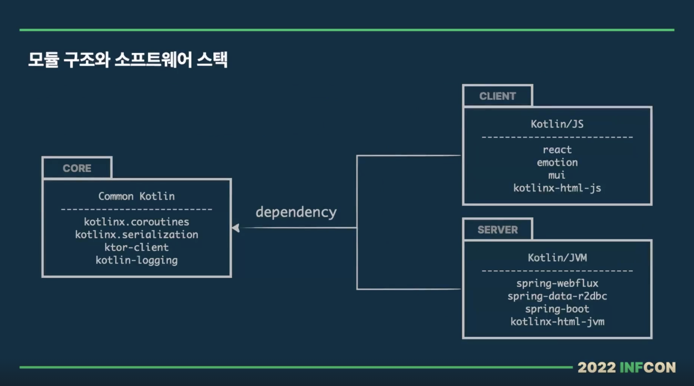
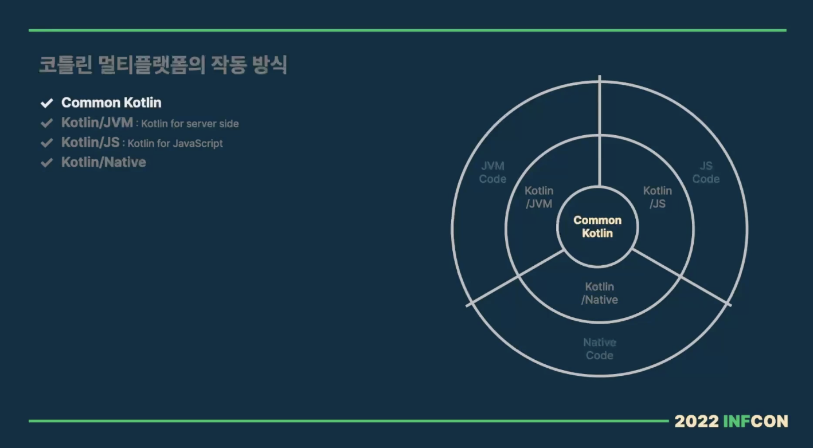
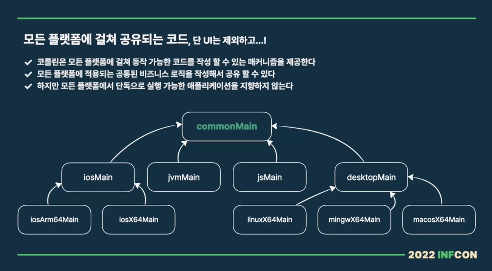

# 코틀린 멀티플랫폼, 미지와의 조우

본 글은 https://inf.run/Nq3y 강좌를 참고하여 작성되었습니다.

간단한 todo 애플리케이션을 제작하기 위해

시작에 앞서 8가지 UseCase를 정의하였습니다.
1. 사용자는 할 일 관리 페이지를 볼 수 있다.
2. 사용자는 등록된 모든 할 일을 볼 수 있다.
3. 사용자는 해야 할 일과 완료된 할 일을 구분해서 여과할 수 있다. (필터링)
4. 사용자는 새로운 할 일을 등록할 수 있다.
5. 사용자는 등록된 할 일을 수정할 수 있다. (내용 변경 또는 완료 처리)
6. 사용자는 등록된 할 일 정리를 할 수 있다.
7. 사용자는 완료된 모든 할 일 정리를 할 수 있다.
8. 사용자는 알림창을 통해 오류 상황을 알 수 있다.

핵심 아키텍처로 클린 아키텍처를 사용하는데 클린 아키텍처에 다양한 정의가 있지만
여기서는 외부에서 내부로 의존성이 흐르는 것과, 애플리케이션 핵심 코드를 세부 구현사항에서 분리시키는데 집중함

3가지 모듈로 나눠서 작성하는데, Core 모듈은 Common Kotlin으로 작성함
Client 모듈은 Core 모듈에 의존하고 있으면서 Kotlin/JS로 작성함 (react, emotion, mui 등 사용)
Server 모듈은 Webflux, r2dbc 등을 사용하여 Reactive하게 구현

실습 프로젝트 참고 링크는 [이 곳](https://github.com/springrunner/practical-kotlin-multiplatform-on-web)입니다.

### 코틀린 멀티플랫폼의 작동 방식

Kotlin 멀티 플랫폼의 핵심은 3가지 컴파일러와 플랫폼 추상화 매커니즘입니다.
1. Kotlin JVM 컴파일러는 Kotlin으로 작성된 코드를 JVM 또는 안드로이드에서 실행할 수 있는 코드인 Java Byte Code로 변환
2. Kotlin JS 컴파일러는 Kotlin으로 작성된 코드를 JavaScript 코드로 변환합니다. Gradle 플러그인을 통해서 의존성 관리부터 애플리케이션 번들링까지 Kotlin JS 프로젝트를 한 곳에서 쉽게 설정하고 제어 가능
3. Kotlin Native 컴파일러는 LLVM 기반의 컴파일러로 코틀린 코드를 버추얼 머신 없이 실행할 수 있는 네이티브 바이너리로 컴파일을 해줌

코틀린 멀티 플랫폼의 핵심적인 요소가 바로 Common 코틀린 영역이다.

Common Kotlin은 언어, 핵심 라이브러리, 기본 도구를 포함해 플랫폼 추상화 매커니즘이 적용되어 있음. 때문에 Common Kotlin에서 작성된 코드는 모든 플랫폼에서 동작할 수 있음.

Kotlin 멀티 플랫폼은 기반 플랫폼 API를 툴 체인이나 프레임워크 등으로 감싸는 방식이 아니라 컴파일러를 통해 대상 플랫폼과 상호작용이 가능한 코드로 변환해줌.
때문에 플랫폼에 구애받지 않는 코드를 작성하고, 이를 서로 다른 플랫폼 간에 공유를 할 수가 있음.

코틀린 멀티 플랫폼의 가장 큰 특징은 모든 플랫폼에 걸쳐 공유되는 핵심 모델과 비즈니스 로직, 테스트 등의 Common 코틀린 코드라고 볼 수 있다.
각 플랫폼 모듈은 Common 코틀린으로 작성된 공유 코드를 기반으로 사용자 인터페이스를 연결해서 전체적인 애플리케이션을 완성함.

