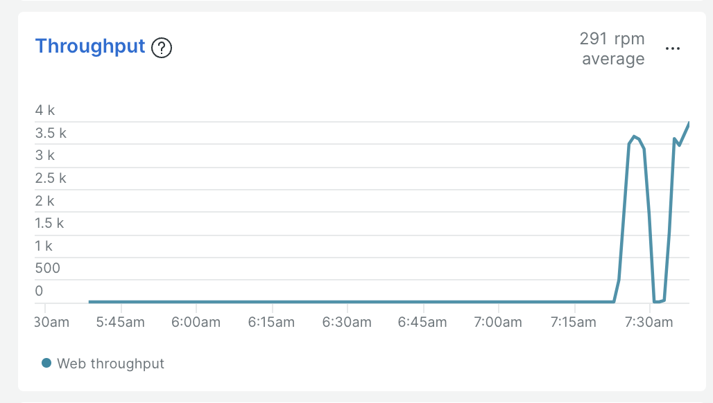

안녕하세요!

B2B 핀테크 서비스 회사에서 일하고 있는 개발자 에디입니다.

최근 팀 내 서비스의 성능 테스트를 진행하면서 겪은 경험과 학습한 내용을 공유드리고자 합니다.
성능 테스트를 처음 접하면서 배운 점들이 많았는데, 저와 비슷한 고민을 하시는 분들께 도움이 되었으면 좋겠습니다!

---

## 성능 테스트의 시작

### 왜 성능 테스트가 필요했나요?

결제 서비스는 순간적으로 많은 트래픽이 몰리는 시스템입니다. 특히 많은 트래픽이 스파이크성으로 몰리는 상황에서도 안정적인 동시성 처리가 필요합니다. 결제는 돈과 직결되는 만큼, 어떤 상황에서도 안정적인 서비스를 제공하는 것이 매우 중요했습니다.

먼저 주요한 확인 포인트는 현재 구조에서는 어느 정도의 트래픽을 처리할 수 있을까? 입니다.

프로덕션 코드를 실제 가져와서 작성할 수 없으니 현재는 간단하게 Mock 형식으로 외부 PG를 구현하고, 추후 Netty 기반의 Http Mocking 라이브러리를 사용해서 개선하려고 합니다.

먼저, 간단한 로직과 코드를 살펴보겠습니다.

### 간단한 결제 서버 및 외부 PG
<br>


*결제 및 외부 PG 구조*

대규모 결제 대행사의 경우는 카드사와 직접 계약을 하겠지만,
규모를 생각해서 외부 결제 대행사(PG)를 거쳐서 결제가 이루어진다고 가정했습니다.

먼저 클라이언트인 결제 서비스의 비즈니스 로직입니다.


결제를 처리하고, 외부 PG에 결제를 요청하는 구조입니다.


실제 PG사에 연결하는 것처럼 100 ~ 200ms의 랜덤한 딜레이 유발했습니다.

성능 테스트에 초점을 맞추기 위해 정말 간단한 구성으로 구현했고,
추후 확장할 포인트는 다음과 같습니다.

1. 데이터 정합성을 위해 낙관적락 도입 
2. 외부 PG사 연동 구간에서의 타임아웃 처리
3. 장애 상황에서의 실패 복구

### 왜? Gatling이야?
성능 테스트에 앞서 여러 성능 테스트 도구들을 비교해보았습니다.

1. Apache JMeter
2. nGrinder
3. Gatling
4. k6

많은 성능테스트 툴이 존재하는데 저는 가능하다면 
Java로 코드를 구성되어 있어서 직관적이고 재사용성이 좋으며, 유지보수하기 좋은 부하테스트 툴을 원했습니다.

###  Gatling 프로젝트 설정

Spring Boot 프로젝트에 Gatling을 적용하는 과정부터 시작했습니다.
플러그인을 통해 gradle 환경에서 gatling을 실행할 수 있게 해주고,
Scala 기반으로 된 gatling-core와 gatling-http가 아닌
Java에서 사용할 수 있는 gatling-core-java와 gatling-http-java를 사용하셔야 해요!

```java
plugins {
    id 'java'
    id 'org.springframework.boot' version '3.2.11'
    id 'io.spring.dependency-management' version '1.1.6'
    id("io.gatling.gradle") version "3.13.1"
}

dependencies {
    ...
    implementation 'io.gatling:gatling-core-java:3.13.1'
    implementation 'io.gatling:gatling-http-java:3.13.1'
    ...
}
...
```

### 성능 테스트 전 사전 준비

*시작에 앞서 성능 테스트를 진행한 환경은 M2 Pro RAM 32GB 입니다.*
*운영체제에서 파일이나 네트워크 I/O 리소스 숫자에 제한이 있기 때문에 제한을 풀어줘야 합니다.*
*저는 MacOS 환경에 맞게 설정하였습니다. 윈도우는 아마 레지스트리쪽 건드려야 할거에요!*

1. limit.maxfiles.plist 생성
```bash
$ sudo vim /Library/LaunchDaemons/limit.maxfiles.plist
```

```xml
<?xml version="1.0" encoding="UTF-8"?>
<!DOCTYPE plist PUBLIC "-//Apple//DTD PLIST 1.0//EN" "http://www.apple.com/DTDs/PropertyList-1.0.dtd">
<plist version="1.0">
<dict>
    <key>Label</key>
    <string>limit.maxfiles</string>
    <key>ProgramArguments</key>
    <array>
        <string>launchctl</string>
        <string>limit</string>
        <string>maxfiles</string>
        <string>8192</string>
        <string>65536</string>
    </array>
    <key>RunAtLoad</key>
    <true/>
</dict>
</plist>
```

그리고 권한을 변경해줍니다.
```bash
$ sudo chmod 644 /Library/LaunchDaemons/limit.maxfiles.plist
$ sudo chown root:wheel /Library/LaunchDaemons/limit.maxfiles.plist
```

그리고 reboot!
```
$ sudo reboot
```

잘 적용됐는지 확인해봅시다.
```
launchctl limit
```

--- 

### 첫 번째 성능 테스트 시나리오

부하테스트는 너무 큰 부하는 거의 모든 요청이 실패하므로 의미가 없다고 생각했습니다. 
적절한 부하를 선택하여 지속적으로 부하를 늘려나가면서 조정하였습니다.

가장 먼저 결제 API에 대한 성능 테스트 하려하는데,
총 4가지 시나리오를 생각하고 진행하였습니다.

1. 단계별 부하 증가 테스트
2. 이벤트성(단발적인) 부하 테스트 시나리오
3. 스트레스 테스트 시나리오
4. 단계적 증가 테스트 시나리오

```java
package payment;

import io.gatling.javaapi.core.ScenarioBuilder;

import java.util.Iterator;

import static io.gatling.javaapi.core.CoreDsl.*;

public class PaymentSimulations extends BasePaymentSimulation {
    // 1. 일일 기본 부하 테스트 시나리오
    ScenarioBuilder dailyLoadTest = scenario("일일_기본_부하_테스트")
            .feed(Iterator.class.cast(feeder))
            .exec(paymentRequest("일일_기본_결제_요청"));

    // 2. 이벤트성 부하 테스트 시나리오
    ScenarioBuilder eventLoadTest = scenario("이벤트_부하_테스트")
            .feed(Iterator.class.cast(feeder))
            .exec(paymentRequest("이벤트_결제_요청"));

    // 3. 스트레스 테스트 시나리오
    ScenarioBuilder stressTest = scenario("스트레스_테스트")
            .feed(Iterator.class.cast(feeder))
            .exec(paymentRequest("스트레스_결제_요청"));

    // 4. 단계적 증가 테스트 시나리오
    ScenarioBuilder incrementalLoadTest = scenario("단계적_증가_테스트")
            .feed(Iterator.class.cast(feeder))
            .exec(paymentRequest("단계적_증가_결제_요청"));


    {
        setUp(
                dailyLoadTest.injectOpen(
                        // 일일 부하 테스트 시나리오
                        rampUsers(50).during(10),                      // 10초 동안 50명 점진적 증가
                        constantUsersPerSec(80).during(15),           // 초당 80명으로 15초 유지
                        rampUsersPerSec(80).to(150).during(10),      // 10초 동안 80명에서 150명으로 증가
                        constantUsersPerSec(150).during(20),          // 초당 150명으로 20초 유지
                        rampUsersPerSec(150).to(80).during(10)       // 10초 동안 150명에서 80명으로 감소
                ).andThen(
                        eventLoadTest.injectOpen(
                                // 이벤트 부하 테스트 시나리오
                                rampUsers(80).during(10),              // 10초 동안 80명 점진적 증가
                                constantUsersPerSec(120).during(15),   // 초당 120명으로 15초 유지
                                rampUsersPerSec(120).to(200).during(10), // 10초 동안 120명에서 200명으로 증가
                                constantUsersPerSec(200).during(20),    // 초당 200명으로 20초 유지
                                rampUsersPerSec(200).to(120).during(10)  // 10초 동안 200명에서 120명으로 감소
                        )
                ).andThen(
                        stressTest.injectOpen(
                                // 스트레스 테스트 시나리오
                                rampUsers(150).during(5),              // 5초 동안 150명 급격히 증가
                                constantUsersPerSec(150).during(15),   // 초당 150명으로 15초 유지
                                stressPeakUsers(250).during(5),        // 5초 동안 250명까지 스파이크
                                constantUsersPerSec(150).during(15),   // 다시 초당 150명으로 15초 유지
                                rampUsersPerSec(150).to(80).during(10) // 10초 동안 150명에서 80명으로 감소
                        )
                ).andThen(
                        incrementalLoadTest.injectOpen(
                                // 단계별 부하 증가 테스트
                                incrementUsersPerSec(60)              // 초당 60명씩 증가
                                        .times(3)                     // 3단계로 진행
                                        .eachLevelLasting(10)         // 각 단계는 10초 유지
                                        .separatedByRampsLasting(8)   // 단계 사이 8초 동안 점진적 증가
                                        .startingFrom(60)             // 초당 60명부터 시작
                        )
                )
        )
                .protocols(httpProtocol)
                .assertions(
                        global().responseTime().percentile3().lt(1000),   // 95%의 응답이 1000ms 이하
                        global().responseTime().percentile4().lt(1500),   // 99%의 응답이 1500ms 이하
                        global().responseTime().max().lt(2500),           // 최대 응답시간 2500ms 이하
                        global().successfulRequests().percent().gt(98d),  // 성공률 98% 이상
                        global().failedRequests().count().lt(200L)        // 실패 요청 200건 미만
                );
    }
}
```

### 첫 번째 테스트 결과


테스트 결과 4000개 가량의 실패가 있으며 시스템이 분당 약 3천개의 요청을 처리할 수 있다는 것과, 
1초 이내 처리되는 요청이 매우 적고 모든 실패는 60초 타임아웃으로 인한 것이며
응답 시간이 전반적으로 매우 높은 것을 알 수 있습니다.




APM에서는 응답시간이 3초정도 걸리고, 처리량도 비슷하게 나온 것을 알 수 있습니다.

자세한 레포트는 여기서 확인하실 수 있습니다.
[첫 번째 테스트 레포트 보기](./paymentsimulations-20241119073425573/index.html)

실제 서버 환경과 동일하게 구성하고 테스트를 진행하던지
테스트 환경에서 테스트 하던지 해야겠지만
간단하게 톰캣 설정, JVM(GC) 설정 등을 조정해서 어느정도 개선이 되는지
확인해보겠습니다.

### 서버 설정

```groovy
...
bootRun {
    jvmArgs = [
            '-Xms2g', // 두 옵션은 맞춰주고 미리 설정해줘야 힙 리사이징 발생 안함
            '-Xmx2g',
            '-XX:+UseParallelGC',                       // Throughput에 최적화된 Parallel GC 사용
            '-XX:ParallelGCThreads=8',                  // 병렬 GC를 위한 스레드 수 (코어 수에 따라 조정)
            '-XX:InitiatingHeapOccupancyPercent=70',    // 70% 사용 시 GC 시작 (힙 활용률 증가)
            '-XX:MaxHeapFreeRatio=30',                  // 힙의 여유 공간 비율 최소화
            '-XX:MinHeapFreeRatio=10',                  // 힙의 여유 공간 비율 최소화
            '-XX:MaxMetaspaceSize=1g',                  // 메타스페이스 크기 최대 1GB로 설정
            '-XX:MetaspaceSize=128m',                   // 초기 메타스페이스 크기
            '-XX:+UseStringDeduplication',              // 문자열 중복 제거 활성화
            '-Xlog:gc*:file=gc.log:time,uptime,level,tags', // GC 로그 파일 저장
            '-XX:+UnlockExperimentalVMOptions',         // 실험적 옵션 활성화
            '-XX:+AlwaysPreTouch'                       // 애플리케이션 시작 시 힙 메모리 미리 할당
    ]
}

bootJar {
    launchScript()
}
...
```
*build.gradle*

```yml
server:
  tomcat:
    threads:
      max: 800                    # 2배 증가: 더 많은 동시 요청 처리
      min-spare: 100             # 더 많은 대기 스레드 유지
    max-connections: 20000       # 2배 증가: 더 많은 TCP 연결 허용
    accept-count: 1000          # 2배 증가: 더 큰 대기열
    connection-timeout: 3000    # 더 빠른 타임아웃으로 실패 빠르게 감지
    keep-alive-timeout: 10000   # Keep-Alive 시간 감소로 리소스 빠른 해제

  # 추가 서버 설정
  compression:
    enabled: true               # 응답 압축 활성화
    min-response-size: 1024     # 최소 압축 크기
  max-http-request-header-size: 40KB # HTTP 헤더 크기 제한

# 추가적인 Spring 설정
spring:
  mvc:
    async:
      request-timeout: 10000    # 비동기 요청 타임아웃 감소
  datasource:
    hikari:
      maximum-pool-size: 50     # DB 커넥션 풀 크기 증가
      minimum-idle: 20
      connection-timeout: 3000  # DB 연결 타임아웃 감소
```
*application.yml*

위와 같이 튜닝해주고 다시 테스트를 진행합니다.

### 두 번째 시나리오


튜닝 후 테스트 결과 단 한건의 실패도 없고,
응답 시간도 매우 매우 준수해진 것을 확인할 수 있습니다.

자세한 레포트는 여기서 확인하실 수 있습니다.
[두 번째 테스트 레포트 보기](./paymentsimulations-20241119081237050/index.html)

### 결론
모든 서비스는 제각기 CPU, Memory 사용량이 다르기 때문에 모든 상황을 커버할 수 있는 옵션이란 없습니다.
(There is no silver bullet!)

때문에 성능테스트 및 운영중인 서비스 모니터링을하며 좀 더 나은 수치를 찾아가는 것이 중요합니다!!


