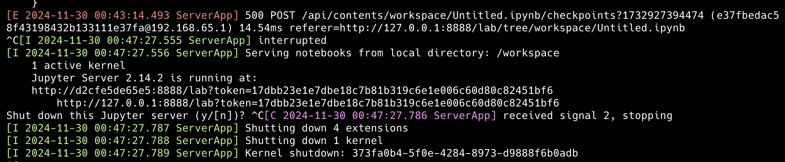
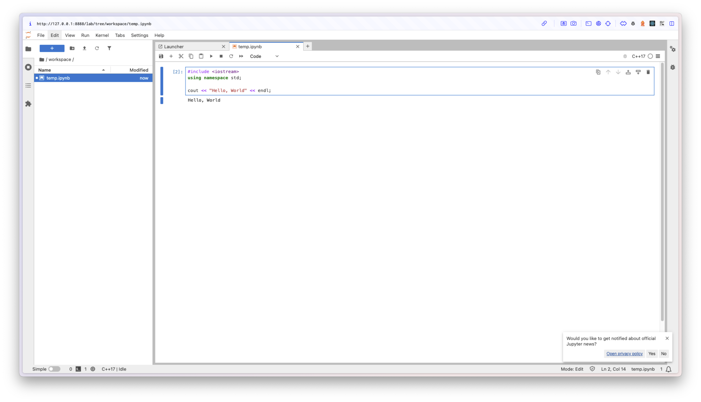

C++ 환경의 주피터 노트북이 필요했는데,
마땅한 이미지 파일이 도커 허브에 없어서 직접 작성했습니다.

```Dockerfile
FROM --platform=linux/amd64 ubuntu:20.04

# 비대화식 모드 설정
ENV DEBIAN_FRONTEND=noninteractive

# 필수 패키지 설치
RUN apt-get update && apt-get install -y \
    wget \
    cmake \
    git \
    libxt-dev \
    libx11-dev \
    libcurl4-openssl-dev \
    libssl-dev \
    clang \
    build-essential \
    python3 \
    python3-pip \
    tzdata

# Timezone 설정
RUN ln -fs /usr/share/zoneinfo/Etc/UTC /etc/localtime && \
    echo "Etc/UTC" > /etc/timezone

# Miniconda 설치 (x86_64 버전)
RUN wget https://repo.anaconda.com/miniconda/Miniconda3-latest-Linux-x86_64.sh -O miniconda.sh && \
    bash miniconda.sh -b -p /opt/conda && \
    rm miniconda.sh && \
    /opt/conda/bin/conda init

# PATH 설정
ENV PATH="/opt/conda/bin:$PATH"

# xeus-cling 및 JupyterLab 설치
RUN conda install -c conda-forge xeus-cling jupyterlab -y

# 작업 디렉토리 설정
WORKDIR /workspace

# 포트 노출
EXPOSE 8888

# JupyterLab 실행
CMD ["jupyter-lab", "--ip=0.0.0.0", "--port=8888", "--no-browser", "--allow-root"]
```

도커 이미지를 빌드합니다.

```$ docker build -t xeus-cling .```

이미지를 컨테이너화 시킵니다.

```$ docker run -it --rm -p 8888:8888 -v $(pwd):/workspace xeus-cling```



콘솔에 뜬 토큰을 포함한 경로로 접속합니다.



```toc
```